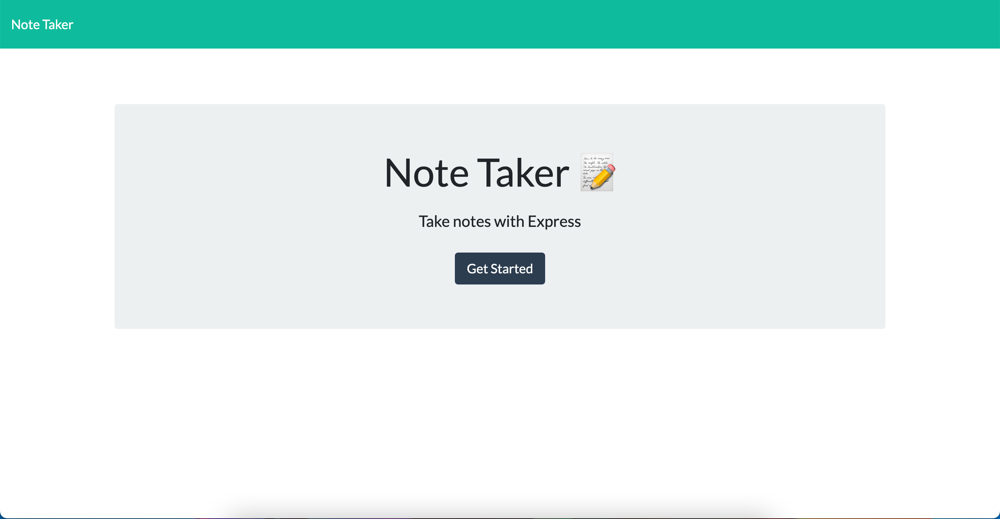
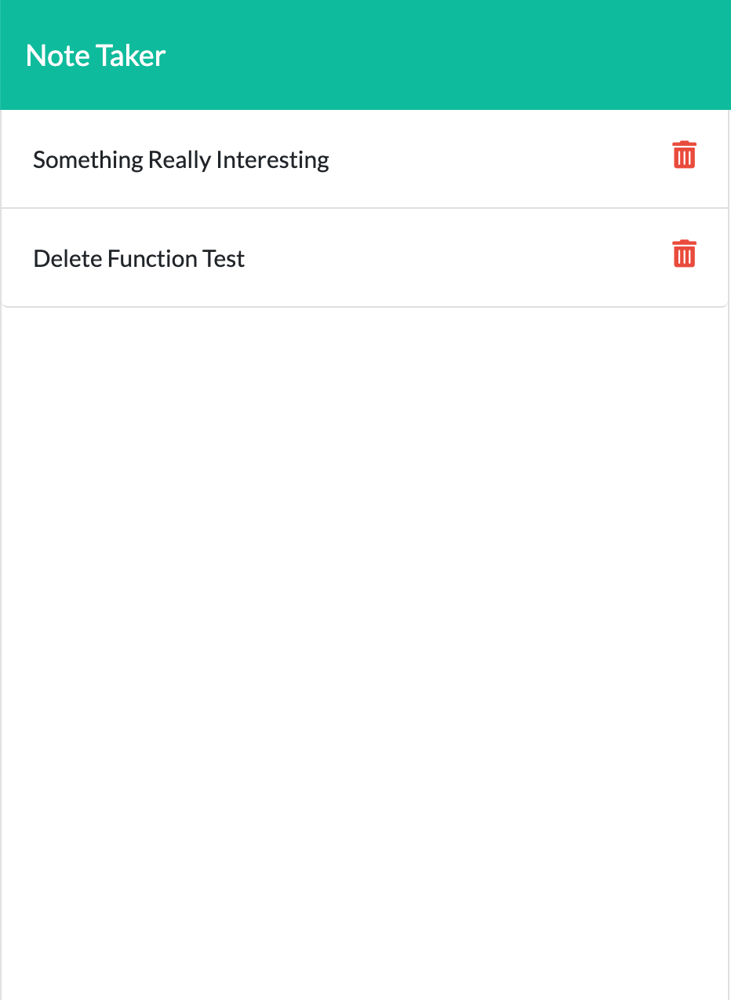
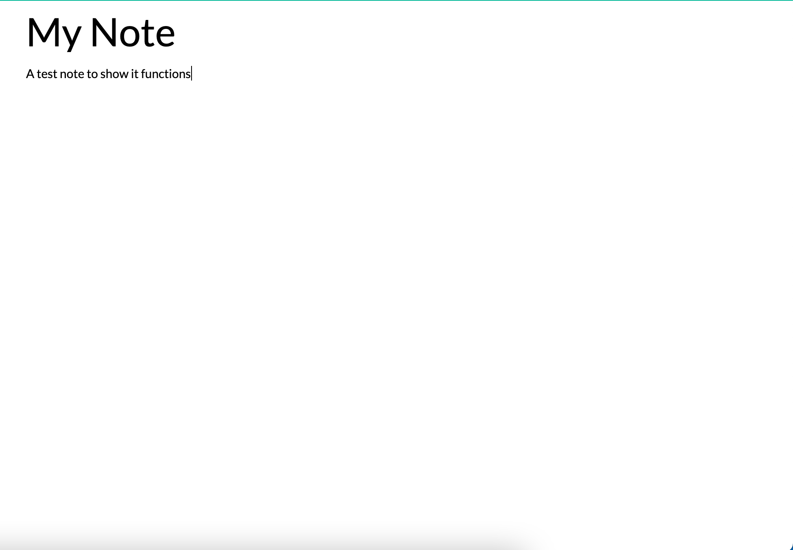
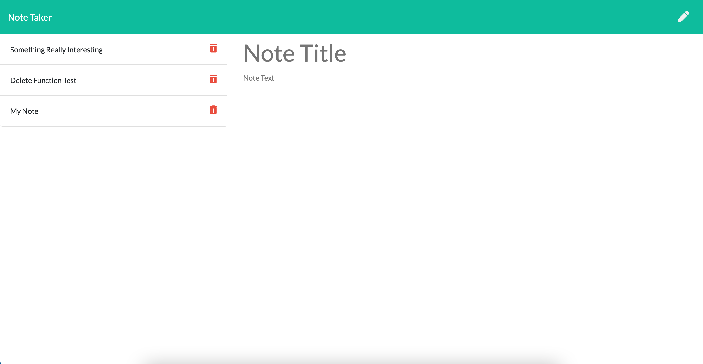

# Note-Taker

## Table of Contents

* **[Description](#Description)**

* **[Installation](#Installation)**

* **[Constributions](#Contributions)**

* **[Testing](#Testing)**

* **[Screenshots](#Screenshots)**

* **[Questions](#Questions)**

### Description

A basic express back end application to take, store and delete notes

### Installation

Open this link **https://fathomless-sea-06351.herokuapp.com/

### Constributions

None

### Testing

None

### Screenshots

### Questions

**Any questions please contact me either [here](https://github.com/tallglassof-milkjake) or at jrmackinlay90@gmail.com
